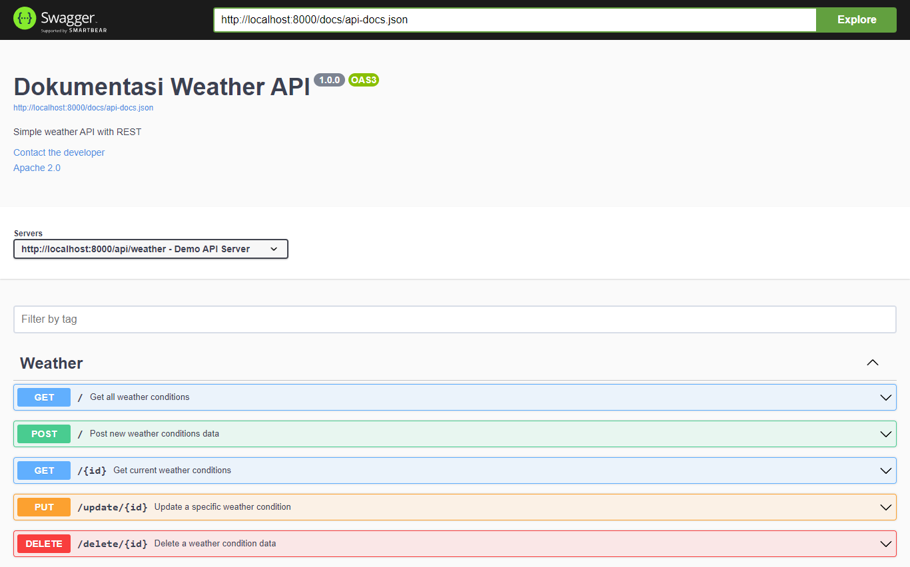

# Weather API

The Weather API is a simple REST API that provides weather information. It allows users to retrieve, add, update, and delete weather conditions data.

## Getting Started

To use the Weather API, you will need to have [PHP](https://www.php.net/) and [Laravel](https://laravel.com/) installed on your machine.

### Installation

1. Clone the repository:

    ```
    git clone https://github.com/<username>/weather-api.git
    ```

2. Install dependencies:

    ```
    cd weather-api
    composer install
    ```

3. Set up the database:

    ```
    php artisan migrate
    ```

### Usage

To start the API server, run the following command in the project directory:

```
php artisan serve
```

This will start the server on `http://localhost:8000`.

## API Endpoints

The Weather API has the following endpoints:

-   `GET /api/weather`: Retrieve all weather conditions
-   `POST /api/weather`: Add a new weather condition
-   `PUT /api/weather/update/{id}`: Update an existing weather condition
-   `DELETE /api/weather/delete/{id}`: Delete a weather condition

## Examples

### Retrieve all weather conditions

To retrieve all weather conditions, make a `GET` request to `/api/weather`. The response will be a JSON array of weather conditions.

```
GET /api/weather

Response:

[
    {
        "id": 1,
        "city": "New York",
        "temperature": 25,
        "description": "Sunny",
        "created_at": "2023-05-14T08:00:00.000000Z",
        "updated_at": "2023-05-14T08:00:00.000000Z"
    },
    {
        "id": 2,
        "city": "London",
        "temperature": 15,
        "description": "Rainy",
        "created_at": "2023-05-14T09:00:00.000000Z",
        "updated_at": "2023-05-14T09:00:00.000000Z"
    }
]
```

### Add a new weather condition

To add a new weather condition, make a `POST` request to `/api/weather` with the following JSON payload:

```
POST /api/weather

Request:

{
    "city": "Tokyo",
    "temperature": 20,
    "description": "Cloudy"
}

Response:

{
    "id": 3,
    "city": "Tokyo",
    "temperature": 20,
    "description": "Cloudy",
    "created_at": "2023-05-14T10:00:00.000000Z",
    "updated_at": "2023-05-14T10:00:00.000000Z"
}
```

### Update an existing weather condition

To update an existing weather condition, make a `PUT` request to `/api/weather/update/{id}` with the following JSON payload:

```
PUT /api/weather/update/3

Request:

{
    "temperature": 25,
    "description": "Sunny"
}

Response:

{
    "id": 3,
    "city": "Tokyo",
    "temperature": 25,
    "description": "Sunny",
    "created_at": "2023-05-14T10:00:00.000000Z",
    "updated_at": "2023-05-14T11:00:00.000
}
```

### Documentation using swagger/openAPI



to see further of this documentation just access :

```

http://localhost:8000/api/documentation

```

<hr/>

<p align="center"><a href="https://laravel.com" target="_blank"></a></p>

<p align="center">
<a href="https://github.com/laravel/framework/actions"></a>
<a href="https://packagist.org/packages/laravel/framework"></a>
<a href="https://packagist.org/packages/laravel/framework"></a>
<a href="https://packagist.org/packages/laravel/framework"></a>
</p>

## About Laravel

Laravel is a web application framework with expressive, elegant syntax. We believe development must be an enjoyable and creative experience to be truly fulfilling. Laravel takes the pain out of development by easing common tasks used in many web projects, such as:

-   [Simple, fast routing engine](https://laravel.com/docs/routing).
-   [Powerful dependency injection container](https://laravel.com/docs/container).
-   Multiple back-ends for [session](https://laravel.com/docs/session) and [cache](https://laravel.com/docs/cache) storage.
-   Expressive, intuitive [database ORM](https://laravel.com/docs/eloquent).
-   Database agnostic [schema migrations](https://laravel.com/docs/migrations).
-   [Robust background job processing](https://laravel.com/docs/queues).
-   [Real-time event broadcasting](https://laravel.com/docs/broadcasting).

Laravel is accessible, powerful, and provides tools required for large, robust applications.

## License

The Laravel framework is open-sourced software licensed under the [MIT license](https://opensource.org/licenses/MIT).
